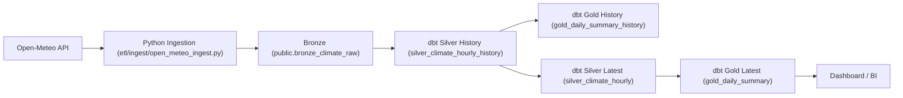

# TCC Clima - Weather Data Pipeline

Pipeline de Engenharia de Dados para TCC com arquitetura em camadas:

`Open-Meteo API -> Ingestao Python -> Bronze -> dbt (Silver History/Latest -> Gold History/Latest) -> Dashboard`


## Visao geral

Este repositorio implementa um pipeline ELT de previsoes meteorologicas horarias usando Open-Meteo como fonte, PostgreSQL como armazenamento, dbt para transformacoes e Apache Airflow para orquestracao. A modelagem preserva o historico por ingestion_time e tambem mantem views correntes com o recorte mais recente por cidade.

O projeto esta preparado para **multiplas cidades** via configuracao (`OPEN_METEO_CITIES_JSON`) sem alterar codigo da DAG.

## Arquitetura



## Stack

- Apache Airflow (orquestracao)
- dbt Core + dbt-postgres (transformacoes e testes)
- PostgreSQL 15 (camadas de dados)
- uv (`pyproject.toml` + `uv.lock`) para dependencias Python
- Docker Compose para ambiente local

## Estrutura do projeto

```text
tcc-clima/
|-- airflow/
|   |-- dags/full_pipeline_open_meteo.py
|   `-- start_airflow.sh
|-- etl/
|   |-- ingest/open_meteo_ingest.py
|   `-- utils/
|       |-- api_client.py
|       `-- db_connection.py
|-- dbt/
|   |-- dbt_project.yml
|   |-- models/example/
|   |   |-- silver_climate_hourly_history.sql
|   |   |-- silver_climate_hourly.sql
|   |   |-- gold_daily_summary_history.sql
|   |   |-- gold_daily_summary.sql
|   |   `-- schema.yml
|   |-- tests/unique_silver_city_record_time.sql
|   `-- tests/unique_silver_history_bronze_record_time.sql
|-- init-db/
|   |-- 01_init_schemas.sql
|   |-- 02_init_bronze_table.sql
|   `-- 03_fix_permissions.sql
|-- docker-compose.yml
|-- pyproject.toml
|-- uv.lock
|-- .env.example
`-- arquitetura.txt
```

## Camadas de dados

- Bronze (`public.bronze_climate_raw`): payload JSON bruto por cidade, com `ingestion_time` preservado.
- Silver historico (`silver_climate_hourly_history`): dados horarios expandidos para cada rodada de ingestao, com rastreabilidade por `bronze_record_id` e `ingestion_time`.
- Silver corrente (`silver_climate_hourly`): recorte da rodada mais recente por cidade.
- Gold historico (`gold_daily_summary_history`): agregacoes diarias por cidade e por rodada de ingestao.
- Gold corrente (`gold_daily_summary`): agregacoes diarias da rodada mais recente por cidade.

> Observacao: no `dbt_project.yml`, os modelos em `models/example/` estao como `materialized: view`.

## Configuracao de ambiente

1. Copie o template:

```bash
cp .env.example .env
```

2. Preencha os valores reais no `.env`.

3. Defina as cidades no formato JSON em `OPEN_METEO_CITIES_JSON`.

Exemplo:

```json
{
  "ribeirao_preto": {"lat": -21.1775, "lon": -47.8103},
  "piracicaba": {"lat": -22.7338, "lon": -47.6476},
  "campinas": {"lat": -22.9099, "lon": -47.0626},
  "sao_jose_do_rio_preto": {"lat": -20.8113, "lon": -49.3758},
  "presidente_prudente": {"lat": -22.1256, "lon": -51.3889}
}
```

Variaveis principais:

- `DB_HOST`, `DB_PORT`, `DB_NAME`, `DB_USER`, `DB_PASS`
- `OPEN_METEO_BASE_URL`, `OPEN_METEO_HOURLY_PARAMS`, `OPEN_METEO_TIMEOUT_SECONDS`, `OPEN_METEO_TIMEZONE`
  - recomendado para ET0: `temperature_2m,relative_humidity_2m,precipitation,dew_point_2m,shortwave_radiation,wind_speed_10m,vapour_pressure_deficit,et0_fao_evapotranspiration`
- `OPEN_METEO_CITIES_JSON`
- `POSTGRES_USER`, `POSTGRES_PASSWORD`, `POSTGRES_DB`
- `AIRFLOW__DATABASE__SQL_ALCHEMY_CONN`
- `AIRFLOW_ADMIN_USERNAME`, `AIRFLOW_ADMIN_PASSWORD`, `AIRFLOW_ADMIN_FIRSTNAME`, `AIRFLOW_ADMIN_LASTNAME`, `AIRFLOW_ADMIN_EMAIL`
- `DBT_PROJECT_DIR`, `PYTHONPATH`, `TIMEZONE`

## Quick start (Docker + Airflow)

Suba os servicos:

```bash
docker compose up -d
```

Verifique status:

```bash
docker compose ps
```

Acesse Airflow:

- URL: `http://localhost:8080`
- Usuario/Senha: definidos por `AIRFLOW_ADMIN_USERNAME` e `AIRFLOW_ADMIN_PASSWORD`

DAG principal:

- `full_pipeline_open_meteo`
- Ordem das tasks: `bronze_ingest -> dbt_run -> dbt_test`
- Agendamento: `@daily`

## Execucao local sem Airflow (opcional)

Sincronize dependencias:

```bash
uv sync
```

Execute ingestao:

```bash
uv run python -m etl.ingest.open_meteo_ingest
```

Execute dbt:

```bash
uv run dbt run --project-dir dbt --target dev
uv run dbt test --project-dir dbt --target dev
```

## Validacao rapida no PostgreSQL

Bronze por cidade:

```sql
select city, count(*) as rows
from public.bronze_climate_raw
group by 1
order by 2 desc;
```

Historico de ingestoes por cidade:

```sql
select city, count(distinct bronze_record_id) as ingestoes
from silver_climate_hourly_history
group by 1
order by 2 desc, 1;
```

Gold corrente por cidade/dia:

```sql
select
  city,
  ingestion_time,
  day,
  avg_temp,
  max_temp,
  total_precipitation,
  total_et0_fao_evapotranspiration
from gold_daily_summary
order by ingestion_time desc, day desc, city;
```

## Qualidade de dados (dbt tests)

- `not_null` em colunas criticas de historico e corrente (`city`, `day`, `record_time`, `ingestion_time`, `bronze_record_id`)
- testes customizados de unicidade composta:
  - `dbt/tests/unique_silver_city_record_time.sql`
  - `dbt/tests/unique_silver_history_bronze_record_time.sql`

## GitHub-friendly e reproducibilidade

- Segredos fora do codigo: `.env` (ignorado pelo git)
- Template versionado: `.env.example`
- Dependencias travadas com `uv.lock`
- Artefatos de runtime ignorados no git:
  - `.venv/`, `dbt/target/`, `dbt/logs/`, `logs/`

## Troubleshooting rapido

Se o Airflow nao abrir:

```bash
docker compose ps
docker compose logs airflow --tail=200
```

Se o Postgres nao aceitar conexao:

```bash
docker compose logs postgres --tail=200
```

Se o dbt falhar por profile/alvo:

- confira `DBT_PROJECT_DIR` no `.env`
- confira se o profile `clima` esta disponivel em `~/.dbt/profiles.yml`

## Contexto academico

Projeto desenvolvido para TCC com foco em boas praticas de Engenharia de Dados:

- separacao por camadas (Bronze/Silver/Gold)
- orquestracao declarativa (Airflow)
- transformacoes testaveis (dbt)
- reproducibilidade de ambiente (uv)
