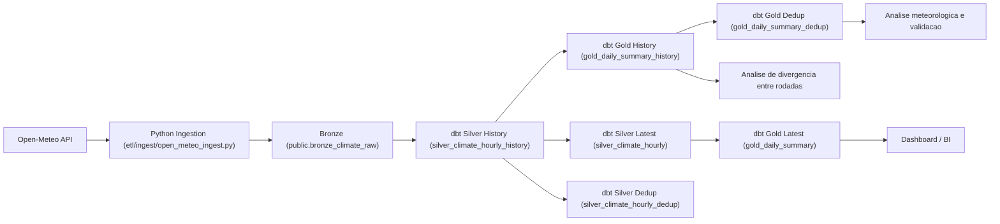

# TCC Clima - Weather Data Pipeline

Pipeline de Engenharia de Dados para TCC com arquitetura em camadas:

`Open-Meteo API -> Ingestao Python -> Bronze -> dbt (Silver History/Latest -> Gold History/Latest) -> Dashboard`


## Dashboard

**[tcc-climate-data-pipeline.streamlit.app](https://tcc-climate-data-pipeline.streamlit.app/)**

Monitoramento de temperatura, precipitacao e ET0 FAO-56 para 5 cidades do interior paulista.

## Visao geral

Este repositorio implementa um pipeline ELT de previsoes meteorologicas horarias usando Open-Meteo como fonte, PostgreSQL como armazenamento, dbt para transformacoes e Apache Airflow para orquestracao. A modelagem preserva o historico por ingestion_time e tambem mantem views correntes com o recorte mais recente por cidade.

O projeto esta preparado para **multiplas cidades** via configuracao (`OPEN_METEO_CITIES_JSON`) sem alterar codigo da DAG.

## Arquitetura


```mermaid
flowchart LR
    A["Open-Meteo API"] --> B["Python Ingestion (etl/ingest/open_meteo_ingest.py)"]
    B --> C["Bronze (public.bronze_climate_raw)"]
    C --> D["dbt Silver History (silver_climate_hourly_history)"]
    D --> E["dbt Gold History (gold_daily_summary_history)"]
    D --> F["dbt Silver Latest (silver_climate_hourly)"]
    D --> I["dbt Silver Dedup (silver_climate_hourly_dedup)"]
    F --> G["dbt Gold Latest (gold_daily_summary)"]
    E --> J["dbt Gold Dedup (gold_daily_summary_dedup)"]
    G --> H["Dashboard / BI"]
    J --> K["Analise meteorologica e validacao"]
    E --> L["Analise de divergencia entre rodadas"]
```

## Stack

- Apache Airflow (orquestracao)
- dbt Core + dbt-postgres (transformacoes e testes)
- PostgreSQL 15 (camadas de dados)
- uv (`pyproject.toml` + `uv.lock`) para dependencias Python
- Docker Compose para ambiente local

## Estrutura do projeto

```text
tcc-clima/
|-- airflow/
|   |-- dags/full_pipeline_open_meteo.py
|   `-- start_airflow.sh
|-- etl/
|   |-- ingest/open_meteo_ingest.py
|   |-- sync/sync_to_neon.py
|   |-- metrics/airflow_metrics.py
|   |-- validation/validate_against_era5.py
|   `-- utils/
|       |-- api_client.py
|       `-- db_connection.py
|-- dashboard/
|   |-- app.py
|   |-- queries.py
|   |-- charts.py
|   `-- db.py
|-- dbt/
|   |-- dbt_project.yml
|   |-- packages.yml
|   |-- profiles.yml.example
|   |-- macros/janela_estudo.sql
|   |-- models/example/
|   |   |-- silver_climate_hourly_history.sql
|   |   |-- silver_climate_hourly.sql
|   |   |-- silver_climate_hourly_dedup.sql
|   |   |-- gold_daily_summary_history.sql
|   |   |-- gold_daily_summary.sql
|   |   |-- gold_daily_summary_dedup.sql
|   |   `-- schema.yml
|   |-- analyses/                      # uma query por tabela do TCC
|   `-- tests/
|       |-- unique_silver_city_record_time.sql
|       |-- unique_silver_history_bronze_record_time.sql
|       |-- rodada_com_168_horas.sql
|       `-- coerencia_temperaturas_gold.sql
|-- init-db/
|   |-- 01_init_schemas.sql
|   |-- 02_init_bronze_table.sql
|   |-- 03_fix_permissions.sql
|   `-- 04_fix_bronze_timestamps.sql
|-- docker-compose.yml
|-- pyproject.toml
|-- requirements.txt
|-- uv.lock
|-- LICENSE
|-- .env.example
`-- arquitetura.txt
```

## Camadas de dados

- Bronze (`public.bronze_climate_raw`): payload JSON bruto por cidade, com `ingestion_time` preservado.
- Silver historico (`silver_climate_hourly_history`): dados horarios expandidos para cada rodada de ingestao, com rastreabilidade por `bronze_record_id` e `ingestion_time`.
- Silver corrente (`silver_climate_hourly`): recorte da rodada mais recente por cidade.
- Silver deduplicada (`silver_climate_hourly_dedup`): um registro por cidade e horario, o da rodada mais recente que o previu.
- Gold historico (`gold_daily_summary_history`): agregacoes diarias por cidade e por rodada de ingestao.
- Gold corrente (`gold_daily_summary`): agregacoes diarias da rodada mais recente por cidade.
- Gold deduplicada (`gold_daily_summary_dedup`): uma previsao por cidade e por data-alvo, a da rodada mais recente que cobriu aquela data.

> Observacao: no `dbt_project.yml`, os modelos em `models/example/` estao como `materialized: view`.

### Qual camada usar para que

| Finalidade | Modelo |
|---|---|
| Caracterizar o periodo meteorologico | `gold_daily_summary_dedup` / `silver_climate_hourly_dedup` |
| Medir divergencia entre rodadas de previsao | `gold_daily_summary_history` |
| Consumo operacional da previsao mais recente | `gold_daily_summary` |

A camada `*_history` guarda uma linha por (cidade, rodada, data-alvo). Como cada rodada
projeta 7 dias a frente e as rodadas se sucedem, uma mesma data do calendario aparece
varias vezes. **Somar precipitacao ou evapotranspiracao sobre a camada historica nao
produz o acumulado do periodo**, e sim a soma de previsoes repetidas para as mesmas datas.
Para isso existem os modelos `*_dedup`.

Ao recortar uma janela de coleta, filtre por `ingestion_time` **antes** de deduplicar. As
macros `gold_dedup_janela` e `silver_dedup_janela` (`dbt/macros/janela_estudo.sql`) fazem
nessa ordem.

## Configuracao de ambiente

1. Copie o template:

```bash
cp .env.example .env
```

2. Preencha os valores reais no `.env`.

3. Defina as cidades no formato JSON em `OPEN_METEO_CITIES_JSON`.

Exemplo:

```json
{
  "ribeirao_preto": {"lat": -21.1775, "lon": -47.8103},
  "piracicaba": {"lat": -22.7338, "lon": -47.6476},
  "campinas": {"lat": -22.9099, "lon": -47.0626},
  "sao_jose_do_rio_preto": {"lat": -20.8113, "lon": -49.3758},
  "presidente_prudente": {"lat": -22.1256, "lon": -51.3889}
}
```

Variaveis principais:

- `DB_HOST`, `DB_PORT`, `DB_NAME`, `DB_USER`, `DB_PASS`
- `NEON_DB_HOST`, `NEON_DB_PORT`, `NEON_DB_NAME`, `NEON_DB_USER`, `NEON_DB_PASS`
- `OPEN_METEO_BASE_URL`, `OPEN_METEO_HOURLY_PARAMS`, `OPEN_METEO_TIMEOUT_SECONDS`, `OPEN_METEO_TIMEZONE`
  - recomendado para ET0: `temperature_2m,relative_humidity_2m,precipitation,dew_point_2m,shortwave_radiation,wind_speed_10m,vapour_pressure_deficit,et0_fao_evapotranspiration`
- `OPEN_METEO_FORECAST_DAYS` (padrao 7): horizonte de previsao, 168 valores horarios por requisicao
- `OPEN_METEO_CITIES_JSON`
- `POSTGRES_USER`, `POSTGRES_PASSWORD`, `POSTGRES_DB`
- `AIRFLOW__DATABASE__SQL_ALCHEMY_CONN`
- `AIRFLOW_ADMIN_USERNAME`, `AIRFLOW_ADMIN_PASSWORD`, `AIRFLOW_ADMIN_FIRSTNAME`, `AIRFLOW_ADMIN_LASTNAME`, `AIRFLOW_ADMIN_EMAIL`
- `DBT_PROJECT_DIR`, `PYTHONPATH`, `TIMEZONE`

## Quick start (Docker + Airflow)

Suba os servicos:

```bash
docker compose up -d
```

Verifique status:

```bash
docker compose ps
```

Acesse Airflow:

- URL: `http://localhost:8080`
- Usuario/Senha: definidos por `AIRFLOW_ADMIN_USERNAME` e `AIRFLOW_ADMIN_PASSWORD`

DAG principal:

- `full_pipeline_open_meteo`
- Ordem das tasks: `bronze_ingest -> dbt_run -> dbt_test -> sync_neon` (quando `NEON_DB_HOST` estiver configurado)
- Agendamento: `@daily`

## Sincronizacao automatica com Neon

Se o seu pipeline principal grava primeiro no PostgreSQL local, voce pode manter o Neon como copia atualizada para o dashboard.

Quando as variaveis `NEON_DB_*` estiverem configuradas no ambiente do Airflow, a DAG executa automaticamente o job `sync_neon` ao final do pipeline diario. Esse job copia para o Neon as tabelas/visoes usadas no projeto:

- `public.bronze_climate_raw`
- `public.silver_climate_hourly_history`
- `public.silver_climate_hourly`
- `public.silver_climate_hourly_dedup`
- `public.gold_daily_summary_history`
- `public.gold_daily_summary`
- `public.gold_daily_summary_dedup`

Fluxo final:

```text
Postgres local -> ingestao Python -> dbt -> sync_neon -> Neon -> Streamlit
```

## Execucao local sem Airflow (opcional)

Sincronize dependencias:

```bash
uv sync
```

Execute ingestao:

```bash
uv run python -m etl.ingest.open_meteo_ingest
```

Execute dbt:

```bash
uv run dbt run --project-dir dbt --target dev
uv run dbt test --project-dir dbt --target dev
```

## Validacao rapida no PostgreSQL

Bronze por cidade:

```sql
select city, count(*) as rows
from public.bronze_climate_raw
group by 1
order by 2 desc;
```

Historico de ingestoes por cidade:

```sql
select city, count(distinct bronze_record_id) as ingestoes
from silver_climate_hourly_history
group by 1
order by 2 desc, 1;
```

Gold corrente por cidade/dia:

```sql
select
  city,
  ingestion_time,
  day,
  avg_temp,
  max_temp,
  min_temp,
  total_precipitation,
  total_et0_fao_evapotranspiration
from gold_daily_summary
order by ingestion_time desc, day desc, city;
```

Base deduplicada (uma previsao por cidade e data-alvo):

```sql
select city, day, lead_days, avg_temp, total_precipitation, total_et0_fao_evapotranspiration
from gold_daily_summary_dedup
order by city, day;
```

## Qualidade de dados (dbt tests)

Instale as dependencias de pacote antes da primeira execucao:

```bash
uv run dbt deps --project-dir dbt
```

A suite tem **102 testes** e cobre:

- `not_null` nas chaves e em todas as colunas de medida, incluindo `min_temp`
- `unique` composto nas chaves de cada camada (`dbt_utils.unique_combination_of_columns`)
- faixas admissiveis por variavel (`dbt_utils.accepted_range`): temperatura -10 a 50 C,
  umidade 0 a 100%, precipitacao nao negativa, ETo horaria 0 a 2 mm, VPD 0 a 10 kPa,
  radiacao 0 a 1500 W/m2, vento 0 a 200 km/h, antecedencia 0 a 6 dias
- integridade referencial de `silver_climate_hourly_history` para a fonte
  `bronze_climate_raw`
- unicidade composta customizada:
  - `dbt/tests/unique_silver_city_record_time.sql`
  - `dbt/tests/unique_silver_history_bronze_record_time.sql`
- `dbt/tests/rodada_com_168_horas.sql`: toda rodada tem exatamente 168 registros horarios
  e 7 datas-alvo. Pega qualquer mudanca no tamanho da resposta da API, que antes passaria
  despercebida e alteraria em silencio todas as contagens por camada.
- `dbt/tests/coerencia_temperaturas_gold.sql`: `max_temp >= avg_temp >= min_temp` nas tres
  visoes gold

## Reprodutibilidade

- Licenca MIT (`LICENSE`)
- Segredos fora do codigo: `.env` (ignorado pelo git)
- Templates versionados: `.env.example` e `dbt/profiles.yml.example`
- Dependencias travadas com `uv.lock`; `requirements.txt` acompanha os mesmos pisos e
  serve apenas ao Streamlit Cloud
- Horizonte de previsao fixado em `forecast_days=7` na chamada a API, para que o tamanho
  da resposta nao dependa do padrao vigente do servico
- `healthcheck` no servico postgres, para o Airflow so subir com o banco pronto
- `dbt/analyses/`: uma query por tabela apresentada no TCC, mais cadencia de ingestao,
  cobertura temporal e metricas operacionais
- `etl/validation/validate_against_era5.py`: validacao das previsoes contra a reanalise
  ERA5
- Artefatos de runtime ignorados no git: `.venv/`, `dbt/target/`, `dbt/logs/`, `logs/`

### Primeira execucao a partir de um clone limpo

```bash
uv sync
cp .env.example .env                          # preencha os valores
mkdir -p ~/.dbt && cp dbt/profiles.yml.example ~/.dbt/profiles.yml
docker compose up -d
uv run dbt deps --project-dir dbt
uv run dbt run  --project-dir dbt --target dev
uv run dbt test --project-dir dbt --target dev
```

### Reproduzir os numeros do TCC

```bash
uv run dbt compile --project-dir dbt --target dev --select path:analyses
```

O SQL compilado sai em `dbt/target/compiled/clima/analyses/` e roda direto no PostgreSQL.
Ver `dbt/analyses/README.md` para o indice das queries.

Validacao contra a reanalise ERA5:

```bash
uv run python -m etl.validation.validate_against_era5
```

## Troubleshooting rapido

Se o Airflow nao abrir:

```bash
docker compose ps
docker compose logs airflow --tail=200
```

Se o Postgres nao aceitar conexao:

```bash
docker compose logs postgres --tail=200
```

Se o dbt falhar por profile/alvo:

- confira `DBT_PROJECT_DIR` no `.env`
- confira se o profile `clima` esta disponivel em `~/.dbt/profiles.yml`

## Contexto academico

Projeto desenvolvido para TCC com foco em boas praticas de Engenharia de Dados:

- separacao por camadas (Bronze/Silver/Gold)
- orquestracao declarativa (Airflow)
- transformacoes testaveis (dbt)
- reproducibilidade de ambiente (uv)
